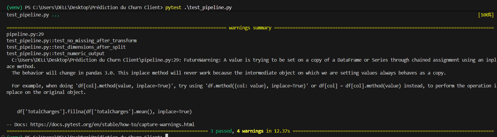
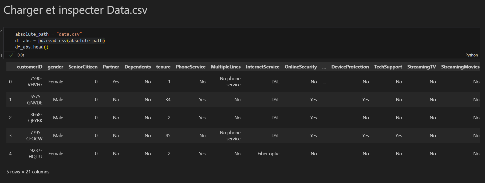

# Prédiction du Churn - Télécom
<div >
 <p align="center">
  
</p>

  <div>
    
    
    
    
    
    
    
    
    
  </div>
---


## Contexte

Projet de prédiction du **churn client** (désabonnement) pour une entreprise de télécommunications.  
Objectif : identifier les clients à risque pour permettre des campagnes de fidélisation ciblées.
---


## Structure du dépôt
```
churn_project/
├── Data.csv
├── pipeline.py
├── test_pipeline.py
├── eda_churn.ipynb
├── README.md
├── requirements.txt
```

---

## Modèles retenus
Après comparaison de plusieurs modèles, **deux modèles** ont été retenus pour la production et le rapport :

### 1. Régression Logistique (Logistic Regression)
- **Accuracy** : 0.742  
- **Recall** : 0.787  
- **F1-score** : 0.617  
- **ROC-AUC** : 0.840  

### 2. SVM (Support Vector Machine)
- **Accuracy** : 0.744  
- **Recall** : 0.800  
- **F1-score** : 0.622  
- **ROC-AUC** : 0.828  

> **Pourquoi ces deux modèles ?**  
> - **Objectif métier** : détecter le plus possible de clients à risque (maximiser le *recall*).  
> - **Régression Logistique** offre un très bon ROC-AUC et une interprétation simple (coefficients exploitables pour expliquer les drivers du churn).  
> - **SVM** présente un recall légèrement supérieur et un F1-score supérieur, ce qui en fait un excellent second modèle si les non-linéarités sont présentes.  
> - **Random Forest**, bien que présentant une accuracy globale plus élevée, a un recall beaucoup plus faible (0.457) et rate donc trop de churners — inadapté ici.

---

## Résumé des étapes du pipeline
1. Chargement et nettoyage des données (`pipeline.load_data`)
   - suppression des colonnes inutiles (ex. `customerID`), conversion de `TotalCharges` en numérique, remplissage des NaN par la moyenne, suppression des doublons.
2. Préparation des données (`pipeline.prepare_data`)
   - encodage des catégoriques (`OneHotEncoder`), normalisation (`StandardScaler`), split train/test.
3. Entraînement (`pipeline.train_models`)
   - modèles : LogisticRegression, RandomForest (optionnel), SVM.
4. Évaluation (`pipeline.evaluate_models`)
   - métriques utilisées : Accuracy, Recall, F1-score, ROC-AUC, PR-AUC (optionnel).

---

## Pourquoi un fichier CSV ?
- Format universel, léger et lisible (texte brut).  
- Compatible natif avec `pandas.read_csv` — pas de dépendance supplémentaire.  
- Facile à partager et à versionner dans Git.  
- Adapté pour un prototype/POC et pour l’itération rapide lors d’un projet data science.

---

## Comment exécuter
1. Cloner le dépôt :
```bash
git clone https://github.com/ismailelghazi/data-ai-project.git
cd churn_project
```

2. Installer les dépendances :
```bash
pip install -r requirements.txt
```

3. Lancer le pipeline :
```bash
python pipeline.py
```

4. Exécuter les tests :
```bash
pytest test_pipeline.py -v
```

---

## Où insérer les images





---

## Fichiers clés
- `pipeline.py` : pipeline complet (chargement, prétraitement, entraînement, évaluation, sauvegarde).  
- `test_pipeline.py` : tests unitaires (vérification absence de NaN après transformation, cohérence des dimensions, types numériques).  
- `notebook_EDA.ipynb` : notebook d’exploration et visualisations (histogrammes, heatmaps, churn par catégorie).

---

## Améliorations possibles
- Recherche d’hyperparamètres (GridSearchCV / RandomizedSearchCV).  
- Sélection de features (VarianceThreshold, SelectKBest, Lasso).  
- Gestion avancée du déséquilibre (SMOTE, undersampling, calibration des seuils).  
- Ajout de courbes ROC/PR et matrice de confusion dans le rapport.  
- Déploiement comme API (FastAPI ou Flask) pour scoring en temps réel ou batch.

---

## Contact / Auteur
Pour toute question ou besoin d'aide : ajoutez un issue sur le dépôt GitHub ou contactez l'auteur du projet.
